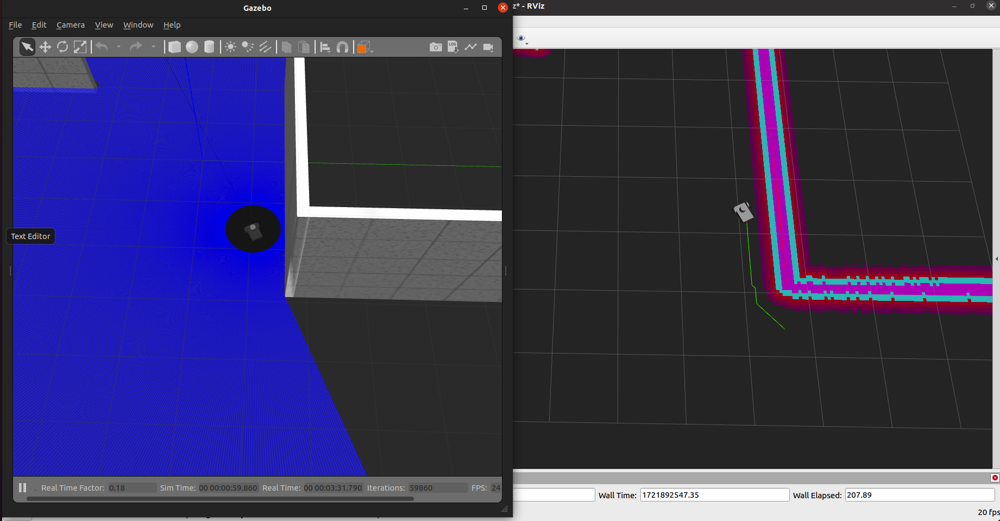

# 2D ROS Wheelbot Navigation
This is a self-learning project of SLAM using simulated robot in ROS and Gazebo environment.  
It mainly focuses on building and implementing differnt path planning methods from scratch.  
Built planning algorithm:
 - A*

# Learning process
## 1. Install ros packages
```
$ sudo apt-get install ros-noetic-joy ros-noetic-teleop-twist-joy ros-noetic-teleop-twist-keyboard ros-noetic-amcl ros-noetic-map-server ros-noetic-move-base ros-noetic-urdf ros-noetic-xacro ros-noetic-rqt-image-view ros-noetic-slam-gmapping ros-noetic-dwa-local-planner ros-noetic-joint-state-publisher-gui
```
## 2. Build customized robot using Autodesk Fusion
In this learning repository, I biult a two-wheel robot car with a lidar sensor.  
After building the model, export it as urdf file using [this github repository](https://github.com/syuntoku14/fusion2urdf).
```
$ roslaunch wheelbot_description gazebo.launch
```
To control the robot with keyboard
```
$ rosrun teleop_twist_keyboard teleop_twist_keyboard.py
```

## 3. Add sensor plugins to Gazebo
All plugins can be found [here](https://classic.gazebosim.org/tutorials?tut=ros_gzplugins).  
Add plugins in wheelbot.gazebo
 - Differential drive controller
 - Laser sensor (non-gpu version)    
Edit gazebo.launch
```
<arg name="paused" value="false"/>
```

## 4. Build customized world using Autodesk Fusion
Save the world as Indoor_world.world in wheelbot_description/worlds/  
Edit gazebo.launch
```
<node name="joint_state_publisher" pkg="joint_state_publisher" type="joint_state_publisher"/>
<node name="robot_state_publisher" pkg="robot_state_publisher" type="robot_state_publisher"/>
<arg name="world_file" value="$(find wheelBot_description)/worlds/Indoor_world.world"/>
```

## 5. Make a map of the world using Gmapping
```
$ roslaunch wheelBot_description gazebo.launch
$ rosrun gmapping slam_gmapping scan:=/rrbot/laser/scan (Used for mapping)
$ rosrun teleop_twist_keyboard teleop_twist_keyboard.py (Control robot movement through keyboard)
$ rosrun map_server map_saver -f Indoor_world_map 	    (Save map)
```

## 6. Prepare for navigation
Open a new package called navigation and prepare files inside.  
In common_costmap.yaml, set robot footprint:
```
footprint: [[-0.1, -0.135], [-0.1, 0.135], [0.1, 0.135], [0.1, -0.135]];
```
More information here:  
[ros navigation](http://wiki.ros.org/navigation/Tutorials/RobotSetup)  
[ros navigation notebook](https://hackmd.io/@yiyunGE/SJna-eOEY?type=view) 
[odom frame explanation 1](https://blog.csdn.net/allenhsu6/article/details/112427489)  
[odom frame explanation 2](https://blog.csdn.net/qq_43481884/article/details/105429655)  
[costmap_2D](https://blog.csdn.net/jinking01/article/details/79455962)  
[occupancy grid](https://www.cnblogs.com/long5683/p/13217716.html)  

## 7. Construct customized global planner
I add my global planner as a plugin following this [ros tutorial](http://wiki.ros.org/navigation/Tutorials/Writing%20A%20Global%20Path%20Planner%20As%20Plugin%20in%20ROS).  
Set different planning methods in movebase.launch
```
<param name="base_global_planner"  value="astar_planner/AstarPlanner"/>
```
Other information regarding global_planner can be found [here](http://wiki.ros.org/global_planner).

## 8. Start navigation
```
$ roslaunch wheelBot_description gazebo.launch
$ roslaunch navigation navigation.launch
```
